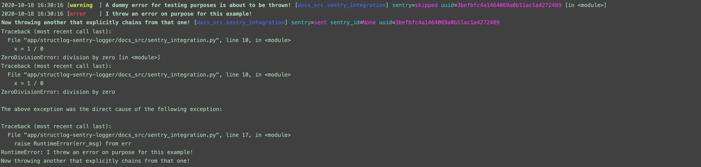

Structlog-Sentry-Logger
==============================


[](https://github.com/pre-commit/pre-commit)
[](https://github.com/psf/black)
[![powered by semgrep](https://img.shields.io/badge/powered%20by-semgrep-1B2F3D?labelColor=lightgrey&link=https://semgrep.dev/&logo=data%3Aimage%2Fpng%3Bbase64%2CiVBORw0KGgoAAAANSUhEUgAAAA0AAAAOCAYAAAD0f5bSAAAABmJLR0QA/gD+AP+cH+QUAAAACXBIWXMAAA3XAAAN1wFCKJt4AAAAB3RJTUUH5AYMEy0l8dkqrQAAAvFJREFUKBUB5gIZ/QEAAP8BAAAAAAMG6AD9+hn/GzA//wD//wAAAAD+AAAAAgABAQDl0MEBAwbmAf36GQAAAAAAAQEC9QH//gv/Gi1GFQEC+OoAAAAAAAAAAAABAQAA//8AAAAAAAAAAAD//ggX5tO66gID9AEBFSRxAgYLzRQAAADpAAAAAP7+/gDl0cMPAAAA+wAAAPkbLz39AgICAAAAAAAAAAAs+vU12AEbLz4bAAAA5P8AAAAA//4A5NDDEwEBAO///wABAQEAAP//ABwcMD7hAQEBAAAAAAAAAAAaAgAAAOAAAAAAAQEBAOXRwxUAAADw//8AAgAAAAD//wAAAAAA5OXRwhcAAQEAAAAAAAAAAOICAAAABP3+/gDjzsAT//8A7gAAAAEAAAD+AAAA/wAAAAAAAAAA//8A7ePOwA/+/v4AAAAABAIAAAAAAAAAAAAAAO8AAAABAAAAAAAAAAIAAAABAAAAAAAAAAgAAAD/AAAA8wAAAAAAAAAAAgAAAAAAAAAAAAAAAAAAAA8AAAAEAAAA/gAAAP8AAAADAAAA/gAAAP8AAAAAAAAAAAAAAAACAAAAAAAAAAAAAAAAAAAA7wAAAPsAAAARAAAABAAAAP4AAAAAAAAAAgAAABYAAAAAAAAAAAIAAAD8AwICAB0yQP78/v4GAAAA/wAAAPAAAAD9AAAA/wAAAPr9//8aHTJA6AICAgAAAAD8AgAAADIAAAAAAP//AB4wPvgAAAARAQEA/gEBAP4BAQABAAAAGB0vPeIA//8AAAAAAAAAABAC+vUz1QAAAA8AAAAAAwMDABwwPu3//wAe//8AAv//ABAcMD7lAwMDAAAAAAAAAAAG+vU0+QEBAvUB//4L/xotRhUBAvjqAAAAAAAAAAAAAQEAAP//AAAAAAAAAAAA//4IF+bTuuoCA/QBAQAA/wEAAAAAAwboAP36Gf8bMD//AP//AAAAAP4AAAACAAEBAOXQwQEDBuYB/foZAAAAAAD4I6qbK3+1zQAAAABJRU5ErkJggg==)](https://semgrep.dev/)
[](https://dependabot.com/)


Overview
--------

A multi-purpose, pre-configured, performance-optimized [`structlog`](https://www.structlog.org/en/stable/) logger
with (optional) [Sentry](https://sentry.io/welcome/) integration
via [`structlog-sentry`](https://github.com/kiwicom/structlog-sentry).

Features
--------
1. Makes logging as easy as using print statements, but prettier and less smelly!
2. Highly opinionated! There are only [two (2) distinct configurations](#output-formatting--storage).
3. Structured logs in JSON format means they are ready to be ingested by many of your
favorite log analysis tools!

What You Get
------------

### Powerful Automatic Context Fields
The pre-configured options include:

1. Timestamps
    - `DATETIME_FORMAT = "%Y-%m-%d %H:%M:%S"`
2. Log levels
    - Added to the JSON context for filtering and categorization
3. Logger names
    - Automatically assigned to namespaced versions of the initializing
python modules (`.py` files), relative to your project directory.
        - e.g., the logger in `docs_src/sentry_integration.py` is named `docs_src.sentry_integration`

With fields sorted by key for easier at-a-glance analysis.

### Performance
`structlog-sentry-logger` is fully-tuned and leverages [`ORJSON`](https://github.com/ijl/orjson)
as the JSON serializer for lightning-fast logging (more than a 4x speedup over
Python's built-in JSON library[[1]](#1)). It's 2021, you don't have to let your
obligate cross-cutting concerns cripple performance any longer!  

For further reference, see:
- "[`ORJSON`: Serialize](https://github.com/ijl/orjson#serialize)" for benchmarks
- "[`structlog`: Performance](https://www.structlog.org/en/stable/performance.html)" for salient performance-related configurations.

<a id="1">[1]</a>
source:
[Choosing a faster JSON library for Python: Benchmarking](https://pythonspeed.com/articles/faster-json-library/#step-4-benchmarking)

### Built-in Sentry Integration (Optional)
Automatically add much richer context to your Sentry reports.
- Your entire logging context is sent as a Sentry event when the `structlog-sentry-logger`
log level is `error` or higher.
    - i.e., `logger.error("")`, `logger.exception("")`
- See [`structlog-sentry`](https://github.com/kiwicom/structlog-sentry) for more details.

------------

Table of Contents

- [Installation](#installation)
- [Usage](#usage)
  * [Pure `structlog` Logging (Without Sentry)](#pure-structlog-logging-without-sentry)
  * [Sentry Integration](#sentry-integration)
    + [Log Custom Context Directly to Sentry](#log-custom-context-directly-to-sentry)
- [Output: Formatting & Storage](#output-formatting--storage)
- [Summary](#summary)
- [Further Reading](#further-reading)
    + [`structlog`](#structlog-structured-logging-for-python)
    + [`Sentry`](#sentry-monitor-and-fix-crashes-in-realtime)
    + [`structlog-sentry`](#structlog-sentry-provides-the-structlog-sentryprocessor-for-sentry-integration)

Installation
============
 ```shell script
pip install structlog-sentry-logger
```

Usage
=====
Pure `structlog` Logging (Without Sentry)
------------------------------------------
At the top of your Python module, import and instantiate the logger:
```python
import structlog_sentry_logger

LOGGER = structlog_sentry_logger.get_logger()
```
Now anytime you want to print anything, don't. Instead do this:
```python
LOG_MSG = "Information that's useful for future me and others"
LOGGER.info(LOG_MSG, extra_field="extra_value")
```
> :note: **Note**  
>  All the regular
>  [Python logging levels](https://docs.python.org/3/library/logging.html#levels)
>  are supported.

Which automatically produces this:
```
{
    "event": "Information that's useful for future me and others",
    "extra_field": "extra_value",
    "level": "info",
    "logger": "docs_src.pure_structlog_logging_without_sentry",
    "sentry": "skipped",
    "timestamp": "2020-10-18 15:30:05"
}
```

Sentry Integration
------------------
Export your [Sentry DSN](https://docs.sentry.io/platforms/python/#configure)
into your local environment.

- An easy way to do this is to put it into a local `.env` file and use
[`python-dotenv`](https://github.com/theskumar/python-dotenv) to populate your environment:
 ```shell script
# On the command line:
SENTRY_DSN=YOUR_SENTRY_DSN
 echo "SENTRY_DSN=${SENTRY_DSN}" >> .env
```

Then load the `.env` file in your Python code prior to instantiating the logger, e.g.:
```python
from dotenv import find_dotenv, load_dotenv
load_dotenv(find_dotenv())

import structlog_sentry_logger
LOGGER = structlog_sentry_logger.get_logger()
```

### Log Custom Context Directly to Sentry
With `structlog`, you can even incorporate custom messages in your exception handling which will automatically be reported to Sentry (thanks to the `structlog-sentry` module):
```python
import uuid

import structlog_sentry_logger

LOGGER = structlog_sentry_logger.get_logger()

curr_user_logger = LOGGER.bind(uuid=uuid.uuid4().hex)  # LOGGER instance with bound UUID
try:
    curr_user_logger.warn("A dummy error for testing purposes is about to be thrown!")
    x = 1 / 0
except ZeroDivisionError as err:
    ERR_MSG = (
        "I threw an error on purpose for this example!\n"
        "Now throwing another that explicitly chains from that one!"
    )
    curr_user_logger.exception(ERR_MSG)
    raise RuntimeError(ERR_MSG) from err
```

```
{
    "event": "A dummy error for testing purposes is about to be thrown!",
    "level": "warning",
    "logger": "docs_src.sentry_integration",
    "sentry": "skipped",
    "timestamp": "2020-10-18 15:29:55",
    "uuid": "181e0e00b9034732af4fed2b8424fb11"
}
{
    "event": "I threw an error on purpose for this example!\nNow throwing another that explicitly chains from that one!",
    "exception": 'Traceback (most recent call last):\n  File "/app/structlog-sentry-logger/docs_src/sentry_integration.py", line 10, in <module>\n    x = 1 / 0\nZeroDivisionError: division by zero',
    "level": "error",
    "logger": "docs_src.sentry_integration",
    "sentry": "sent",
    "sentry_id": null,
    "timestamp": "2020-10-18 15:29:55",
    "uuid": "181e0e00b9034732af4fed2b8424fb11"
}
Traceback (most recent call last):
  File "/app/structlog-sentry-logger/docs_src/sentry_integration.py", line 10, in <module>
    x = 1 / 0
ZeroDivisionError: division by zero

The above exception was the direct cause of the following exception:

Traceback (most recent call last):
  File "/app/structlog-sentry-logger/docs_src/sentry_integration.py", line 17, in <module>
    raise RuntimeError(ERR_MSG) from err
RuntimeError: I threw an error on purpose for this example!
Now throwing another that explicitly chains from that one!
```

Output: Formatting & Storage
==============================
The default behavior is to stream JSON logs directly to the standard output
stream [like a proper 12 Factor App](https://12factor.net/logs).

For local development, it often helps to prettify logging to stdout and save
JSON logs to a `.logs` folder at the root of your project directory for later
debugging. To enable this behavior, set the following environment variable
(e.g. via [`python-dotenv`](https://github.com/theskumar/python-dotenv) as in
the [Sentry Integration](#sentry-integration) section):
```bash
CI_ENVIRONMENT_SLUG=dev-local
```
In doing so, with our previous exception handling example we would get:



Development
===========

> 📝 **Note**  
>  For convenience, many of the below processes are abstracted away
>  and encapsulated in single [Make](https://www.gnu.org/software/make/) targets.


> 🔥 **Tip**  
>  Invoking `make` without any arguments will display
>  auto-generated documentation on available commands.

Package and Dependencies Installation
--------------------------------------

Make sure you have Python 3.6+ and [`poetry`](https://python-poetry.org/)
installed and configured.

To install the package and all dev dependencies, run:
```shell script
make provision_environment
```

> 🔥 **Tip**  
>  Invoking the above without `poetry` installed will emit a
>  helpful error message letting you know how you can install poetry.

Testing
------------

We use [`tox`](https://tox.readthedocs.io/en/latest/) for our test automation framework
and [`pytest`](https://pytest.readthedocs.io/) for our testing framework.

To invoke the tests, run:

```shell script
make test
```

Run [mutation tests](https://opensource.com/article/20/7/mutmut-python) to validate test suite robustness (Optional):

```shell script
make test-mutations
```

> 📝 **Note**  
>  Test time scales with the complexity of the codebase. Results are cached
>  in `.mutmut-cache`, so once you get past the initial [cold start problem](https://en.wikipedia.org/wiki/Cold_start_(recommender_systems)),
>  subsequent mutation test runs will be much faster; new mutations will only
>  be applied to modified code paths.

Code Quality
------------

We are using [`pre-commit`](https://pre-commit.com/) for our code quality
static analysis automation and management framework.

To invoke the analyses and auto-formatting over all version-controlled files, run:

```shell script
make lint
```

> 🚨 **Danger**  
>  CI will fail if either testing or code quality fail,
>  so it is recommended to automatically run the above locally
>  prior to every commit that is pushed.

### Automate via Git Pre-Commit Hooks

To automatically run code quality validation on every commit (over to-be-committed
files), run:

```shell script
make install-pre-commit-hooks
```

> ⚠️ Warning  
>  This will prevent commits if any single pre-commit hook fails
>  (unless it is allowed to fail)
>  or a file is modified by an auto-formatting job;
>  in the latter case, you may simply repeat the commit and it should pass.

Documentation
--------------

```shell script
make docs-clean docs-html
```

> 📝 **Note**  
>  For faster feedback loops, this will attempt to automatically open the newly
>  built documentation static HTML in your browser.

Summary
=======
That's it. Now no excuses.
Get out there and program with pride knowing no one
will laugh at you in production! For not logging properly, that is. You're on your own
for that other [observability](https://devops.com/metrics-logs-and-traces-the-golden-triangle-of-observability-in-monitoring/) stuff.

Further Reading
===============


## [`structlog`](https://www.structlog.org/en/stable/#): Structured Logging for Python


## [`Sentry`](https://sentry.io/welcome/): Monitor and fix crashes in realtime.

## [`structlog-sentry`](https://github.com/kiwicom/structlog-sentry): Provides the [`structlog`](https://www.structlog.org/en/stable/#) `SentryProcessor` for [Sentry](https://sentry.io/welcome/) integration.

---

Legal
=====

License
-------

Structlog-Sentry-Logger is licensed under the Apache License, Version 2.0.
See [LICENSE](./LICENSE) for the full license text.


Credits
-------

This project was generated from
[`@TeoZosa`'s](https://github.com/TeoZosa)
[`cookiecutter-cruft-poetry-tox-pre-commit-ci-cd`](https://github.com/TeoZosa/cookiecutter-cruft-poetry-tox-pre-commit-ci-cd)
template.
