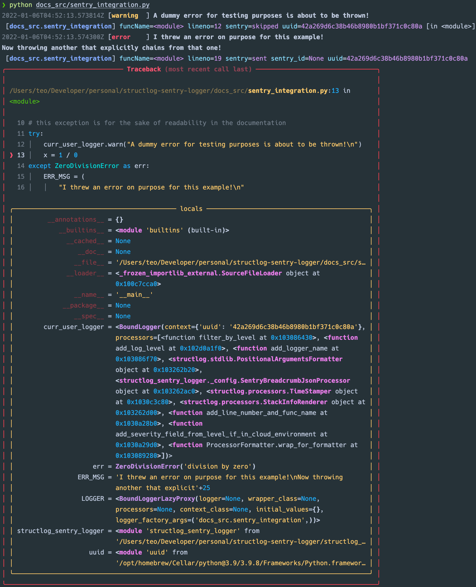
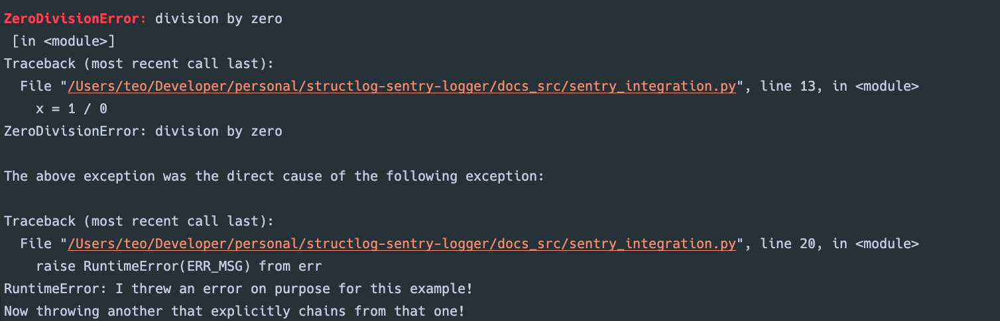

Structlog-Sentry-Logger
==============================
[](https://github.com/TeoZosa/structlog-sentry-logger/actions/workflows/ci.yml)

[](https://structlog-sentry-logger.readthedocs.io/en/latest/?badge=latest)


[](https://github.com/pre-commit/pre-commit)
[](https://github.com/charliermarsh/ruff)
[](https://github.com/psf/black)
[![powered by semgrep](https://img.shields.io/badge/powered%20by-semgrep-1B2F3D?labelColor=lightgrey&link=https://semgrep.dev/&logo=data%3Aimage%2Fpng%3Bbase64%2CiVBORw0KGgoAAAANSUhEUgAAAA0AAAAOCAYAAAD0f5bSAAAABmJLR0QA/gD+AP+cH+QUAAAACXBIWXMAAA3XAAAN1wFCKJt4AAAAB3RJTUUH5AYMEy0l8dkqrQAAAvFJREFUKBUB5gIZ/QEAAP8BAAAAAAMG6AD9+hn/GzA//wD//wAAAAD+AAAAAgABAQDl0MEBAwbmAf36GQAAAAAAAQEC9QH//gv/Gi1GFQEC+OoAAAAAAAAAAAABAQAA//8AAAAAAAAAAAD//ggX5tO66gID9AEBFSRxAgYLzRQAAADpAAAAAP7+/gDl0cMPAAAA+wAAAPkbLz39AgICAAAAAAAAAAAs+vU12AEbLz4bAAAA5P8AAAAA//4A5NDDEwEBAO///wABAQEAAP//ABwcMD7hAQEBAAAAAAAAAAAaAgAAAOAAAAAAAQEBAOXRwxUAAADw//8AAgAAAAD//wAAAAAA5OXRwhcAAQEAAAAAAAAAAOICAAAABP3+/gDjzsAT//8A7gAAAAEAAAD+AAAA/wAAAAAAAAAA//8A7ePOwA/+/v4AAAAABAIAAAAAAAAAAAAAAO8AAAABAAAAAAAAAAIAAAABAAAAAAAAAAgAAAD/AAAA8wAAAAAAAAAAAgAAAAAAAAAAAAAAAAAAAA8AAAAEAAAA/gAAAP8AAAADAAAA/gAAAP8AAAAAAAAAAAAAAAACAAAAAAAAAAAAAAAAAAAA7wAAAPsAAAARAAAABAAAAP4AAAAAAAAAAgAAABYAAAAAAAAAAAIAAAD8AwICAB0yQP78/v4GAAAA/wAAAPAAAAD9AAAA/wAAAPr9//8aHTJA6AICAgAAAAD8AgAAADIAAAAAAP//AB4wPvgAAAARAQEA/gEBAP4BAQABAAAAGB0vPeIA//8AAAAAAAAAABAC+vUz1QAAAA8AAAAAAwMDABwwPu3//wAe//8AAv//ABAcMD7lAwMDAAAAAAAAAAAG+vU0+QEBAvUB//4L/xotRhUBAvjqAAAAAAAAAAAAAQEAAP//AAAAAAAAAAAA//4IF+bTuuoCA/QBAQAA/wEAAAAAAwboAP36Gf8bMD//AP//AAAAAP4AAAACAAEBAOXQwQEDBuYB/foZAAAAAAD4I6qbK3+1zQAAAABJRU5ErkJggg==)](https://semgrep.dev/)


---

**Documentation**: [https://structlog-sentry-logger.readthedocs.io](https://structlog-sentry-logger.readthedocs.io)

**Source Code**: [https://github.com/TeoZosa/structlog-sentry-logger](https://github.com/TeoZosa/structlog-sentry-logger)

---


:teacher: Overview
------------------

A multi-purpose, pre-configured,
performance-optimized [`structlog`](https://www.structlog.org/en/stable/) logger with
(optional) [Sentry](https://sentry.io/welcome/) integration
via [`structlog-sentry`](https://github.com/kiwicom/structlog-sentry).

:sparkles: Features
-------------------

1. Makes logging as easy as using print statements, but prettier and easier to capture and filter!
2. Highly opinionated! There are
   only [two (2) distinct configurations](#chart_with_downwards_trend-output-formatting--storage).
3. Structured logs in JSON format means they are ready to be ingested by many of your
   favorite log analysis tools!
4. [Cloud Logging compatible](#cloud-cloud-logging-compatibility)!


:confetti_ball: What You Get
----------------------------

### :muscle: Powerful Automatic Context Fields

The pre-configured options include:

1. :watch: Timestamps
    - UTC time in [ISO 8601](https://en.wikipedia.org/wiki/ISO_8601) format
      (`YYYY-MM-DDTHH:MM:SS.ffffffZ`)
2. :vertical_traffic_light: Log levels
    - Added to the JSON context for filtering and categorization
3. :mag: Logger names
    - Automatically assigned to namespaced versions of the initializing python
      modules (`.py` files), relative to your project directory.
        - e.g., the logger in `docs_src/sentry_integration.py` is
          named `docs_src.sentry_integration`
4. :mag_right: Function names and line numbers where logging calls were made

> :fire: **Tip**  
> For easier at-a-glance analysis, you can also sort log fields by key by exporting
> the `STRUCTLOG_SENTRY_LOGGER_KEY_SORTING_ON` environment variable. Note, however, that
> this has a substantial (`~1.6x`) performance penalty.
> - See [`orjson`'s `OPT_SORT_KEYS` documentation](https://github.com/ijl/orjson#opt_sort_keys)
>   for more information.

### :zap: Performance

`structlog-sentry-logger` is C-compiled and fully-tuned,
leveraging [`orjson`](https://github.com/ijl/orjson)
as the JSON serializer for lightning-fast logging (more than a 4x speedup over Python's
built-in JSON library[^1]; see
[here](https://teozosa.github.io/structlog-sentry-logger/dev/bench/Linux/CPython/3.8/64bit/c_library/)
for sample performance benchmarks). Don't let your obligate cross-cutting concerns
cripple performance any longer!

For further reference, see:

- "[`orjson`: Serialize](https://github.com/ijl/orjson#serialize)" for benchmarks
- "[`structlog`: Performance](https://www.structlog.org/en/stable/performance.html)" for
  salient performance-related configurations.

[^1]: Source: [Choosing a faster JSON library for Python: Benchmarking](https://pythonspeed.com/articles/faster-json-library/#step-4-benchmarking)

### :robot: Built-in Sentry Integration (Optional)

Automatically add much richer context to your Sentry reports.

- Your entire logging context is sent as a Sentry event when
  the `structlog-sentry-logger`
  log level is `error` or higher.
    - i.e., `logger.error("")`, `logger.exception("")`
- See [`structlog-sentry`](https://github.com/kiwicom/structlog-sentry) for more
  details.

------------

Table of Contents

<!-- toc -->

- [:tada: Installation](#tada-installation)
- [:rocket: Usage](#rocket-usage)
  * [:loud_sound: Pure `structlog` Logging (Without Sentry)](#loud_sound-pure-structlog-logging-without-sentry)
  * [:outbox_tray: Log Custom Context Directly to Sentry (optional)](#outbox_tray-log-custom-context-directly-to-sentry-optional)
  * [:cloud: Cloud Logging Compatibility](#cloud-cloud-logging-compatibility)
- [:chart_with_downwards_trend: Output: Formatting & Storage](#chart_with_downwards_trend-output-formatting--storage)
- [:clipboard: Summary](#clipboard-summary)
- [:books: Further Reading](#books-further-reading)
  * [:one: `structlog`: Structured Logging for Python](#one-structlog-structured-logging-for-python)
  * [:two: `Sentry`: Monitor and fix crashes in realtime](#two-sentry-monitor-and-fix-crashes-in-realtime)
  * [:three: `structlog-sentry`: Provides the `structlog` integration for Sentry](#three-structlog-sentry-provides-the-structlog-integration-for-sentry)
- [:wrench: Development](#wrench-development)
  * [:building_construction: Package and Dependencies Installation](#building_construction-package-and-dependencies-installation)
  * [:package: Python Module to C-Extension Compilation](#package-python-module-to-c-extension-compilation)
  * [:white_check_mark: Testing](#white_check_mark-testing)
  * [:rotating_light: Code Quality](#rotating_light-code-quality)
    + [:arrows_counterclockwise: Automate via Git Pre-Commit Hooks](#arrows_counterclockwise-automate-via-git-pre-commit-hooks)
  * [:memo: Documentation](#memo-documentation)
- [:judge: Legal](#judge-legal)
  * [:page_facing_up: License](#page_facing_up-license)
  * [:busts_in_silhouette: Credits](#busts_in_silhouette-credits)

<!-- tocstop -->

:tada: Installation
===================

 ```shell script
pip install structlog-sentry-logger
```

Optionally, install Sentry integration with

 ```shell script
pip install "structlog-sentry-logger[sentry]"
```

:rocket: Usage
==============
:loud_sound: Pure `structlog` Logging (Without Sentry)
------------------------------------------------------
Simply import and instantiate the logger:

```python
import structlog_sentry_logger

LOGGER = structlog_sentry_logger.get_logger()
```

Now you can start adding logs as easily as print statements:

```python
LOGGER.info("Your log message", extra_field="extra_value")
```

> :memo: **Note**  
> All the regular
> [Python logging levels](https://docs.python.org/3/library/logging.html#levels)
> are supported.

Which automatically produces this:

```json
{
    "event": "Your log message",
    "extra_field": "extra_value",
    "funcName": "<module>",
    "level": "info",
    "lineno": 5,
    "logger": "docs_src.pure_structlog_logging_without_sentry",
    "timestamp": "2022-01-11T07:05:37.164744Z"
}
```


:outbox_tray: Log Custom Context Directly to Sentry (optional)
------------------------------------------------

If you installed the library with the optional Sentry integration you can incorporate
custom messages in your exception handling which will automatically be
reported to Sentry (thanks to the [`structlog-sentry`](https://github.com/kiwicom/structlog-sentry)
module). To enable this behavior, export the
`STRUCTLOG_SENTRY_LOGGER_CLOUD_SENTRY_INTEGRATION_MODE_ON` environment variable.

An easy way to do this is to put it into a local `.env` file[^2]:

```bash
echo "STRUCTLOG_SENTRY_LOGGER_CLOUD_SENTRY_INTEGRATION_MODE_ON=" >> .env
```

> :memo: **️Note**  
> By default, only logs at error-level or above are sent to Sentry. If you want to set a
> different minimum log level, you can specify
> [a valid Python log level](https://docs.python.org/3/library/logging.html#logging-levels)
> via the `STRUCTLOG_SENTRY_LOGGER_SENTRY_LOG_LEVEL` environment variable.
>
> For example, to send all logs at warning-level or above to Sentry you would simply set
> `STRUCTLOG_SENTRY_LOGGER_SENTRY_LOG_LEVEL=WARNING`

For a concrete example, given the following Python code:

```python
import uuid

import structlog_sentry_logger

LOGGER = structlog_sentry_logger.get_logger()

curr_user_logger = LOGGER.bind(uuid=uuid.uuid4().hex)  # LOGGER instance with bound UUID
try:
    curr_user_logger.warn("A dummy error for testing purposes is about to be thrown!")
    x = 1 / 0
except ZeroDivisionError as err:
    ERR_MSG = (
        "I threw an error on purpose for this example!\n"
        "Now throwing another that explicitly chains from that one!"
    )
    curr_user_logger.exception(ERR_MSG)
    raise RuntimeError(ERR_MSG) from err
```

We would get the following output:

```json lines
{
    "event": "A dummy error for testing purposes is about to be thrown!\n",
    "funcName": "<module>",
    "level": "warning",
    "lineno": 12,
    "logger": "docs_src.sentry_integration",
    "sentry": "skipped",
    "timestamp": "2022-01-06T04:50:07.627633Z",
    "uuid": "fe2bdcbe2ed74432a87bc76bcdc9def4"
}
{
    "event": "I threw an error on purpose for this example!\nNow throwing another that explicitly chains from that one!\n",
    "exc_info": true,
    "funcName": "<module>",
    "level": "error",
    "lineno": 19,
    "logger": "docs_src.sentry_integration",
    "sentry": "sent",
    "sentry_id": null,
    "timestamp": "2022-01-06T04:50:07.628316Z",
    "uuid": "fe2bdcbe2ed74432a87bc76bcdc9def4"
}
Traceback (most recent call last):
  File "/app/structlog-sentry-logger/docs_src/sentry_integration.py", line 10, in <module>
    x = 1 / 0
ZeroDivisionError: division by zero

The above exception was the direct cause of the following exception:

Traceback (most recent call last):
  File "/app/structlog-sentry-logger/docs_src/sentry_integration.py", line 17, in <module>
    raise RuntimeError(ERR_MSG) from err
RuntimeError: I threw an error on purpose for this example!
Now throwing another that explicitly chains from that one!
```

:cloud: Cloud Logging Compatibility
-----------------------------------
The logger will attempt to infer if an application is running in a cloud environment by
inspecting for the presence of environment variables that may be automatically injected
by cloud providers (namely, `KUBERNETES_SERVICE_HOST`, `GCP_PROJECT`,
and `GOOGLE_CLOUD_PROJECT`).

If any of these environment variables are detected, log levels will be duplicated to a
reserved `severity` key in the emitted logs to enable parsing of the log level and the
remaining log context (as `jsonPayload`) by [Cloud Logging](https://cloud.google.com/logging)
(see: [Cloud Logging: Structured logging](https://cloud.google.com/logging/docs/structured-logging)).

> :memo: **️Note**  
> This behavior can also be manually enabled by adding the
> `STRUCTLOG_SENTRY_LOGGER_CLOUD_LOGGING_COMPATIBILITY_MODE_ON`
> variable to your environment, e.g., via a `.env` file[^2].

> :warning:️ **Warning**  
> If a user manually specifies a value for the `severity` key, it will be overwritten!
> Avoid using this key if possible to preempt any future issues.


:chart_with_downwards_trend: Output: Formatting & Storage
=========================================================
The default behavior is to stream JSON logs directly to the standard output
stream [like a proper 12 Factor App](https://12factor.net/logs).

For local development, it often helps to prettify logging to stdout and save JSON logs
to a `.logs` folder at the root of your project directory for later debugging. To enable
this behavior, export the `STRUCTLOG_SENTRY_LOGGER_LOCAL_DEVELOPMENT_LOGGING_MODE_ON`
environment variable, e.g., in your local `.env` file[^2]:

```bash
echo "STRUCTLOG_SENTRY_LOGGER_LOCAL_DEVELOPMENT_LOGGING_MODE_ON=" >> .env
```

In doing so, with our previous exception handling example we would get:




[^2]: This library uses [`python-dotenv`](https://github.com/theskumar/python-dotenv)
to automatically populate your environment with this variable (if it exists) from the
local `.env` file. Alternatively, you may use
[`direnv`](https://github.com/direnv/direnv) and a `.envrc` file. A sample `.envrc` file
(with all features enabled) has been provided at the root of the repository
([`.envrc.sample`](./.envrc.sample)). If [`direnv`](https://github.com/direnv/direnv) is
already installed, it's as simple as copying [`.envrc.sample`](./.envrc.sample) to the
root of your project, editing it to reflect your desired configurations, renaming it
to `.envrc`, and running `direnv allow` :tada:

:clipboard: Summary
===================
That's it. Now no excuses. Get out there and program with pride knowing no one will
laugh at you in production! For not logging properly, that is. You're on your own for
that
other [observability](https://devops.com/metrics-logs-and-traces-the-golden-triangle-of-observability-in-monitoring/)
stuff.

:books: Further Reading
=======================


## :one: `structlog`: Structured Logging for Python
- [https://www.structlog.org/en/stable/](https://www.structlog.org/en/stable/#)


## :two: `Sentry`: Monitor and fix crashes in realtime
- [https://sentry.io/welcome/](https://sentry.io/welcome/)

## :three: `structlog-sentry`: Provides the `structlog` integration for Sentry
- [https://github.com/kiwicom/structlog-sentry](https://github.com/kiwicom/structlog-sentry)

---

:wrench: Development
====================

For convenience, implementation details of the below processes are abstracted away and
encapsulated in single [Make](https://www.gnu.org/software/make/) targets.


> :fire: **Tip**  
> Invoking `make` without any arguments will display
> auto-generated documentation on available commands.

:building_construction: Package and Dependencies Installation
-------------------------------------------------------------

Make sure you have [uv](https://github.com/astral-sh/uv) installed and configured.

To install the package and all dev dependencies, run:

```shell script
make provision-environment
```

> :fire: **Tip**  
> Invoking the above without `uv` installed will emit a
> helpful error message letting you know how you can install uv.

:package: Python Module to C-Extension Compilation
--------------------------------------------------
The projects's [build.py](./build.py) file specifies which modules to package.

For manual per-module compilation, see:
[Mypyc Documentation: Getting started - Compiling and running](https://mypyc.readthedocs.io/en/latest/getting_started.html#compiling-and-running)

:white_check_mark: Testing
--------------------------

We use [`tox`](https://tox.readthedocs.io/en/latest/)
and [`pytest`](https://pytest.readthedocs.io/) for our test automation and testing
frameworks, respectively.

To invoke the tests, run:

```shell script
make test
```

Run [mutation tests](https://opensource.com/article/20/7/mutmut-python) to validate test
suite robustness (Optional):

```shell script
make test-mutations
```

> :information_source: **Technical Details**  
> Test time scales with the complexity of the codebase. Results are cached
> in `.mutmut-cache`, so once you get past the initial [cold start problem](https://en.wikipedia.org/wiki/Cold_start_(recommender_systems)),
> subsequent mutation test runs will be much faster; new mutations will only
> be applied to modified code paths.

:rotating_light: Code Quality
-----------------------------

We use [`pre-commit`](https://pre-commit.com/) for our static analysis automation and
management framework.

To invoke the analyses and auto-formatting over all version-controlled files, run:

```shell script
make lint
```

> :rotating_light: **Danger**  
> CI will fail if either testing or code quality fail,
> so it is recommended to automatically run the above locally
> prior to every commit that is pushed.

### :arrows_counterclockwise: Automate via Git Pre-Commit Hooks

To automatically run code quality validation on every commit (over to-be-committed
files), run:

```shell script
make install-pre-commit-hooks
```

> :warning:️ **Warning**  
> This will prevent commits if any single pre-commit hook fails
> (unless it is allowed to fail)
> or a file is modified by an auto-formatting job;
> in the latter case, you may simply repeat the commit and it should pass.

:memo: Documentation
--------------------

```shell script
make docs-clean docs-html
```

> :fire: **Tip**  
> For faster feedback loops, this will attempt to automatically open the newly
> built documentation static HTML in your browser.

:judge: Legal
=============

:page_facing_up: License
------------------------

Structlog-Sentry-Logger is licensed under the Apache License, Version 2.0.
See [LICENSE](./LICENSE) for the full license text.


:busts_in_silhouette: Credits
-----------------------------

This project was generated from
[`@TeoZosa`'s](https://github.com/TeoZosa)
[`cookiecutter-cruft-poetry-tox-pre-commit-ci-cd`](https://github.com/TeoZosa/cookiecutter-cruft-poetry-tox-pre-commit-ci-cd)
template.
